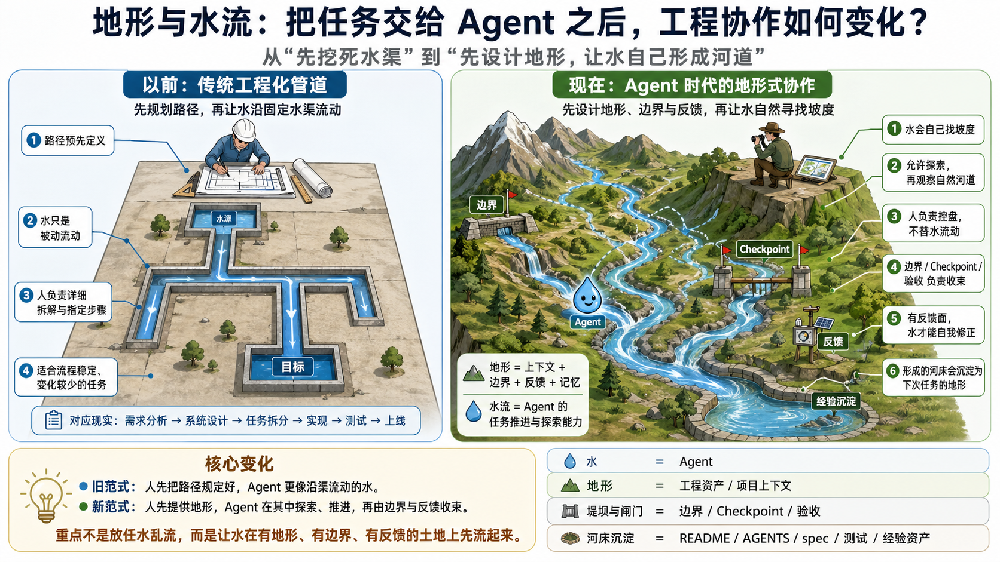
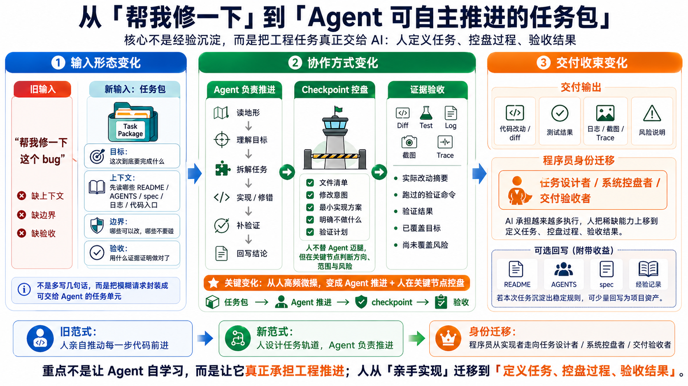

# 别再把大需求直接丢给模型：一套可复制的 AI Coding Harness 工作法

很多人已经开始用 AI 写代码，但真正拉开差距的，不是“有没有用 AI”，而是你能不能把一个真实工程任务交给 AI，并且让它稳定地跑完、验收、交接。

大模型时代有一个很残酷的长尾现象：头部和尾部的差距会被迅速拉大。

这个长尾不只发生在某家公司、某个研发团队内部，在整个现实社会里会更明显。很多人还停留在“把大模型当一个会聊天的人”的阶段；再往前一步，是把它当搜索、问答或文本生成工具；到了工程现场，很多人也只是让它补单测、写注释、改几行样板代码。

而头部使用者已经在做另一件事：同时推进多个任务包，让模型读地形、切方案、实现、验证、回写，并在关键节点介入转向。差距不在于谁打开了哪个聊天窗口，而在于谁有能力把模型接进真实工程链路。

这件事比写 Prompt 难。

因为大模型不是传统工具。它不是一个你按按钮、它给确定结果的函数。它更像一股有能力、有惯性、会自己找路的水；也像一个聪明但没有组织记忆、没有责任边界、没有风险感的临时工程师。

你把它当补全器，它就只能当打字员。

你把整包需求扔给它，它就会变成黑盒外包。

真正有效的 AI Coding 在中间：人不再逐行遥控，但也不退场。人负责定义地形、修河岸、设闸门、看水位、验收下游结果；模型负责在边界内探索、实现、试错和修正。



这就是 Harness。


这篇文章想讲清楚一件事：

```text
AI Coding 的核心不是 Prompt，而是 Harness。
```

这篇文章适合三类读者：

```text
已经用过 ChatGPT / Claude / Codex 写代码，但经常觉得结果不稳定的工程师；
想把 AI Coding 从个人技巧变成团队方法的 TL / 架构师；
正在尝试让 Agent 处理真实工程任务，但不知道怎么拆任务、控上下文、验收结果的人。
```

如果你只想找几句“神奇 Prompt”，这篇文章可能会显得有点重；但如果你想让 AI 真正参与工程交付，下面这套方法会更接近真实答案。

Harness 不是某一句神奇提示词，也不是一套重流程。它是一套把非确定性模型接进确定性工程交付的控制方法。

它回答五个问题：

```text
任务怎么切？
上下文怎么给？
边界怎么守？
过程怎么控？
结果怎么验？
```

这里还隐含第六件事：过程怎么留下痕迹。

AI Coding 一旦进入真实工程，不能只停留在聊天窗口里。目标、边界、checkpoint、验证结果和剩余风险，都应该能被回看、汇报和交接。否则任务做完了，组织却没有留下任何可复用的工程资产。

下面我用两个真实开源项目贯穿全文：

- [`huisezhiyin/adaptive-room-harness`](https://github.com/huisezhiyin/adaptive-room-harness)
- [`huisezhiyin/agent-experience-capitalization`](https://github.com/huisezhiyin/agent-experience-capitalization)

它们都是真实的 Harness 项目。前者解决“复杂任务什么时候唤醒一个多 Agent 讨论室”；后者解决“Agent 做过的任务经验如何沉淀成后续可用的工程资产”。

这两个项目比虚构案例更能说明问题：它们不是一次性写完的，而是在多轮目标、讨论、转向、验证和留痕里长出来的。

文中的对话片段来自公开开源项目推进过程，已经做过脱敏和少量书面化处理，不包含任何企业内部代码、业务数据或私有环境信息。

文章里提到的 Skill 也不是概念稿，而是已经放在 [`huisezhiyin/sdd-riper`](https://github.com/huisezhiyin/sdd-riper) 里的可用工作流。读完以后，你可以直接把它装进自己的 Agent 环境，用在日常 AI Coding 里。

这篇文章会先讲清楚理念骨架，再进入操作层。

理念部分只回答一个问题：为什么大模型时代的工程协作，需要任务大小、上下文、自由度和留痕这些控制面。

实施部分只回答一个问题：拿到一个真实任务后，怎么把它做成任务包，交给模型推进，并在检查点、真实对话、测试验证和归档里把它收回来。

## 一、核心理念：Harness 是大模型工程的控制面

大模型本质上是概率系统。

它不是不能做复杂事，而是复杂任务里的变量太多，随机偏移会不断累积。你给它一个加法函数，它几乎一定写得很好；你让它一次性做一个完整的多 Agent 协作室，或者一个完整的经验资产化系统，它就很容易越跑越散。

所以 Harness 的核心，不是“怎么给模型更多东西”，而是怎么控制混沌的尺度。

如果说模型是一股会自己找路的水，那么 Harness 不是水本身，也不是一张规定每一滴水怎么流的路线图。

Harness 是河岸、闸门、水位标尺和下游验收点。

它不替水流动，但决定水能在哪个范围里流、什么时候需要停、流到哪里算有效、溢出边界时怎么收回来。

AI Coding 最微妙的地方在于：你不是简单地“放开”或“收紧”，而是在不同任务里动态调节任务大小、上下文和自由度。

这里先放一张概念地图，下一章再展开。

第一层是三个控制旋钮：

```text
最小混沌单元：控制这轮任务有多大。
上下文分层：控制模型看见什么地形。
自由度设计：控制模型能在多大范围内自己找路。
```

这里的“最小混沌单元”借用混沌工程的说法，强调它不是一个普通功能点，而是一个有目标、有边界、有验收、失败后可以局部恢复的任务单元。

第二层是五个工程对象：

```text
任务包：把需求切成可自治推进的工作单元。
codemap：把代码库变成可渐进回读的地形索引。
spec：把目标、边界、决策、验证和恢复点落成真相源。
checkpoint：让模型在关键节点停下来，暴露下一步动作和风险。
evidence：用测试、日志、结果、人工验收反向证明任务是否完成。
```

旋钮负责控制混沌，工程对象负责把控制落到真实协作里。两层合在一起，才是 AI Coding 里的控制面。

如果用企业研发流程来类比，可以先这样理解：

| 传统研发节点 | Harness 里的对应物 | 差别 |
| --- | --- | --- |
| 需求评审 / PRD | 任务包 / spec | 不只是写给人看，还要变成模型执行和验收的约束 |
| 模块依赖图 / 架构图 | codemap | 不是静态文档，而是让模型按需回读代码地形的索引 |
| 开发前方案确认 | checkpoint | 不审 500 行代码，先审模型下一步准备怎么动 |
| CI / 单测 / 预发验证 | evidence | 不听“完成了”，用结果和日志反向证明 |
| PR 描述 / 知识库 | handoff / archive | 让下一轮任务不用从零重新喂背景 |

这不是把老流程换一套名字，而是给 AI 执行过程加上可观察、可验证、可恢复的控制约束。

## 二、三个控制旋钮：任务大小、上下文和自由度

很多 AI Coding 的失败，不是发生在代码阶段，而是发生在第一句话。

比如你这样开场：

```text
帮我做一个完整的多 Agent 协作系统。
```

这句话的问题不是“不够礼貌”，而是工程含义太空。

一个多 Agent 协作室里可能有 room 生命周期、参与者配置、运行时适配器、讨论协议、artifact 落盘、审批状态、恢复点、可视化观察器、CLI 命令、测试替身、失败回退。

你把它整包丢给模型，模型只能自己补全缺失信息。它可能先写 UI，也可能先设计复杂协议，也可能顺手做常驻 agent、后台服务、权限模型、插件市场。最后它给你一个“完成了”，但你很难判断它到底完成了什么，也很难放心合并。

这不是模型坏。

这是任务没有被 Harness。

更好的第一句话不是让它直接写代码，而是让它先进入地形：

```text
请使用 Harness / SDD-RIPER 的方式处理这个任务。
先不要改代码。

目标：
  我们要做第一块最小闭环：
  让 Codex CLI 可以拉起两个 agent 参与同一个 room。

请你先阅读相关上下文，输出：
1. 你理解的目标是什么
2. 这件事可能涉及哪些模块或文件
3. 哪些事情应该明确不做
4. 这个任务的最大风险是什么
5. 你建议如何把它切成最小混沌单元
6. 后续用什么证据证明完成
```

这一步不是让模型写计划作文。

它是在阻止模型还没看地形就直接开挖。

如果它连目标都复述不清，不要让它改代码。

如果它说不出验证方式，不要让它改代码。

如果它一上来就想重构一大片，也不要让它改代码。

这就是 Harness 的第一道门：先对齐目标，再进入执行。

### 第一个旋钮：任务大小

最小混沌单元不是“越小越好”，而是“刚好能让模型自主完成，又能让人类稳定验收”。

```text
小到目标清楚、边界可见、结果能验、失败能局部重来；
大到模型仍然有自主设计和实现空间。
```

为什么一定要拆？

可以借链表来理解。

构建一条很长的链表，最差的做法是什么？是从头到尾一口气接到底，最后才发现方向错了、指针接错了、尾巴没有接回头部。这时候要修的不是某一个节点，而是整条链表。

但也不需要每接一个节点就停下来检查。那会太碎，反而把执行打断到没有效率。

更好的方式是让链表一段一段往前生长：每走一小段，就确认这一段接得对不对、需不需要纠偏。接得上，就继续推进；接不上，就在局部修正——而不是等整条链表全部接完，才发现方向早就偏了。

这和 AI Coding 是同一个道理。

一个大任务如果运气好，模型一路跑完、代码没偏、测试也过，那当然皆大欢喜。但真实工程里更常见的是：最初输入有一点纰漏，模型对代码地形有一点误判，或者中途选了一条看似合理但方向错误的路线。

如果等超大任务全部跑完以后才检查，小问题也许还能补，路线级错误就很痛苦。你不只是改几行代码，而是要重新判断它从哪里开始偏、哪些 diff 受影响、哪些测试结果不再可信，甚至要从头来过。

所以任务包和 checkpoint 的价值，不是让流程看起来严谨，而是把错误暴露得更早，把回滚半径压得更小。

```text
大任务一次跑完：
  省了中间检查，但失败时返工半径巨大。

小任务分段推进：
  每跑完一段就检查，发现偏航就局部纠偏。
```

一次性大任务的风险，不是“它一定失败”。

真正的风险是：它失败得太晚。

“实现一个多 Agent 协作系统”太大。

它应该被切成多个可验收的小闭环：

```text
1. 创建一个 room，并记录基本状态
2. 拉起两个本地 agent，进入同一个 room
3. 记录 transcript，并生成可查看的 artifact
4. 支持 room list / show / status / close
5. 支持按需 wake，而不是让 agent 常驻
6. 生成 room_synthesis / execution_plan
7. 支持 accept-plan / reject-plan
8. 生成恢复点，让下一次 wake 能接上上下文
9. 提供只读观察界面
10. 把 room 的经验沉淀成后续任务可用的资产
```

第一轮最适合交给模型的，不是“做完整协作室”，而是：

```text
完成最小 room 闭环：
Codex CLI 能拉起两个 agent，
两个 agent 能围绕同一个任务各发一次言，
本地能看到 transcript / artifact。
```

这个任务足够小，模型不容易漂。

它也足够完整，人类可以验收一个真实闭环。

一个好的最小混沌单元，至少要满足六个条件：

```text
目标能一句话讲清楚。
边界能说清哪些做、哪些不做。
上下文能收拢到有限材料。
结果能通过测试、日志、截图或人工验收判断。
失败后能局部回炉，不需要推倒整件事。
模型仍然有自主设计和实现空间。
```

这个能力会变成 AI Coding 时代最重要的工程判断力之一。

以前任务拆分是为了人类协作。

现在任务拆分是在给概率系统设计合适的运行空间。

### 第二个旋钮：上下文

如果最小混沌单元决定“任务有多大”，那么上下文决定“模型看见什么地形”。

上下文太多，会腐烂。

多轮对话以后，旧方案、临时猜测、已经否掉的路径、半完成的结论、过期的前提都会留在窗口里。模型背着这些历史噪音继续往前跑，目标会被稀释，边界会变模糊。

上下文太少，也会偏。

你只说一句“优化一下 room”，模型自由度就太高。它可能理解成命令体验优化，也可能理解成状态模型重构，还可能顺手改掉你不想动的 runtime 契约。

所以关键不是多给或少给，而是给刚好的上下文。

建议把上下文分成三层：

```text
核心上下文：
  本轮必须常驻的目标、事实、边界和验收标准。

按需上下文：
  相关文档、代码入口、历史方案、日志、测试、接口说明。
  模型需要时再读，不要全部塞进对话。

排除上下文：
  已经废弃的方案、不相关模块、不要顺手处理的需求。
```

记住：我们要节约的不是 token，而是上下文。

省 token 是成本问题。

省上下文是质量问题。

这也是为什么 `sdd-riper-one-light` 和 `sdd-riper-one` 都会落一份 spec。

spec 不是形式主义文档，也不是把聊天记录再复制一遍。它是本地持久化的精炼上下文：目标、边界、关键事实、决策、验证结果、剩余风险和下一轮恢复点，都被压缩到一个可以回读、可以交接、可以审计的地方。

长对话里的上下文会腐烂，但落盘 spec 可以作为外部真相源。模型下一轮不需要背完整聊天历史，只需要按需回读 spec 的相关小节，再结合 codemap 去找代码地形。

### 第三个旋钮：自由度

自由度不是越高越好，也不是越低越好。要看场景。

低风险、探索性、反馈快的任务，可以让模型自己找路。

高风险、强约束、反馈慢的任务，要先修河岸、设闸门，再让水流。

顺着模型，不是模型说什么都对。

顺着模型，是当它提出一个更贴近代码地形的方案时，你不要立刻把它拉回自己的第一设想，而是要求它讲清楚：

```text
为什么更适合当前代码地形？
是否仍然满足本轮目标？
有没有扩大 scope？
风险是什么？
如何验证？
失败后如何局部回炉？
```

## 三、任务包：把控制旋钮落成可执行契约

只说“做多 Agent room”仍然不够。

你还要把它包装成一个模型能执行、人类能验收的任务包。

一个任务包至少包含六件事：



```text
目标：这次到底要完成什么。
上下文：模型需要知道什么，哪些材料按需读取。
边界：哪些可以改，哪些不能碰。
自由度：哪些地方让模型自己选路，哪些地方必须严格执行。
验收：什么证据能证明做对了。
回收：完成后哪些经验要沉淀下来。
```

一个任务包可以这样写：

```text
目标：
  本轮到底要完成什么。
  最好能用一两句话说清楚可交付结果。

上下文：
  核心上下文：
    本轮必须常驻的信息。

  按需上下文：
    需要时再读取的文档、代码入口、日志、测试、接口说明。

  排除上下文:
    本轮不要处理、不要顺手带入、已经废弃的内容。

边界：
  哪些可以改。
  哪些不能碰。
  哪些未来能力明确不做。

自由度：
  哪些地方允许模型自己选路。
  哪些地方必须严格按约束执行。

验收：
  哪些测试、日志、结果、截图、人工验收可以证明完成。

回收：
  完成后哪些入口、约束、测试方式、经验要回写到 spec / summary / archive。
```

这不是“写长 Prompt”。

这是给模型一份最小任务契约。

模型知道自己要做什么，人类也知道最后怎么验收。

这六项里，最容易被低估的是上下文、验收和回收。

上下文决定模型看见什么地形；验收决定“完成”有没有证据；回收决定这次踩过的入口、测试方式、约束和坑，下一次是不是还要从零再喂一遍。

这里要特别区分 `spec` 和 `codemap`。

它们不是一个东西，也不建议合并：

| 对象 | 负责什么 | 不负责什么 |
| --- | --- | --- |
| spec | 定义目标、边界、验收、决策和恢复点 | 不提前写死所有实现文件 |
| codemap | 定义代码地形、入口、依赖、风险点和验证入口 | 不替代需求和验收标准 |
| checkpoint | 拿 spec 的目标和 codemap 的边界，检查模型下一步能不能动 | 不替代最终验收 |

可以理解成一个握手协议：

```text
spec 说：这次要做什么，做到什么才算完成。
codemap 说：这件事应该在哪些代码地形里发生。
checkpoint 说：模型下一步动作是否同时满足目标和边界。
```

可以直接让模型参与上下文整理：

```text
请先整理本轮上下文，不要改代码。

请输出：
1. 核心上下文：本轮必须常驻的信息
2. 按需上下文：需要时再读取的文件、文档、日志或测试
3. 排除上下文：本轮不要带入、不要处理、已经废弃的内容
4. 当前上下文是否足够执行
5. 如果不足，只问最关键的 1-3 个问题
```

这一步非常适合复杂项目，也很适合团队里 AI Coding 经验还不均衡的人。

它能避免两种常见失败：

```text
一种是上下文太多，把模型塞晕；
一种是上下文太少，让模型自由发挥到偏航。
```

## 四、真实项目流程：从任务包到自由推进

从这一章开始，我们正式进入真实项目。

第一个项目是 [`adaptive-room-harness`](https://github.com/huisezhiyin/adaptive-room-harness)。它要做的不是普通聊天室，而是一个面向复杂代码任务的多 Agent room：当主 Agent 遇到复杂任务时，可以按需唤醒多个参与者讨论、拆解、生成方案，并把 transcript / artifact 留在本地。

第二个项目是 [`agent-experience-capitalization`](https://github.com/huisezhiyin/agent-experience-capitalization)。它解决的是另一件事：Agent 做过的任务经验，如何被沉淀成后续任务能复用的工程资产。

这两个项目的推进方式很接近：先切任务包，再让模型围绕目标自由推进，中间通过 checkpoint、真实对话、验证证据和 spec 回写来控盘。

先看 `adaptive-room-harness` 第一轮的任务包。

```text
目标：
  完成 adaptive-room-harness 的最小 room 闭环：
  Codex CLI 能拉起两个 agent，
  两个 agent 能进入同一个 room 并围绕同一任务发言，
  本地能留下 transcript 和 artifact。

上下文：
  核心上下文：
    本轮只处理 room 最小可运行闭环。
    只做 agent 拉起、单轮讨论、transcript / artifact 落盘。

  按需上下文：
    docs/IDEA_DOC_V2.md、CLI 入口、room service、runtime adapter、现有测试。

  排除上下文:
    观察界面、长期心跳、复杂审批流、插件市场、多模型调度、云端同步。

边界：
  只处理最小 room play 链路。
  不做常驻 agent，不做完整 UI，不做复杂权限系统。
  不重构整个项目目录。

自由度：
  可以让 Agent 自己选择最小改动路径。
  但 room 状态、transcript、artifact 的文件契约必须明确。

验收：
  能用一条命令创建 room 并拉起两个 agent。
  能看到两个 agent 的发言记录。
  能在本地找到 transcript / artifact。
  失败时能看到清晰错误，而不是静默吞掉。
  给出测试命令或人工验证步骤。

回收：
  如果发现 room 生命周期、adapter 契约或恢复点设计不清楚，补到任务 summary。
```

从这里开始，模型不是拿到一个“做完整系统”的黑盒需求，而是拿到一个目标清楚、边界清楚、上下文分层、验收可见的任务包。

真实项目里，自由度不是单独讲出来的，而是写进任务包和执行指令里。

探索性任务，可以放开一点：

```text
请阅读 room play 链路，找出完成最小双 agent room 闭环的最小改动路径。
你可以自己选择实现方案，但必须满足：
1. 不扩大 scope
2. 不破坏现有 CLI 入口
3. 不改变 room 状态和 artifact 文件契约
4. 给出风险和验证方式
5. 修改前先 checkpoint
```

严格任务，要收紧一点：

```text
这是 room 状态 / runtime adapter / artifact 契约相关任务。
请严格按下面约束执行，不要自行改变已有文件契约或执行语义。

允许：
  在指定文件范围内做最小实现。

禁止：
  修改 room 状态字段语义。
  改变 adapter 调用约定。
  顺手处理观察界面、长期心跳、云端同步等无关能力。
  引入未经确认的新依赖。

执行前必须给 checkpoint。
```

### 任务包生命周期

从这里开始，我们不再只讲理念，而是进入真实项目里的完整流程。

在 `adaptive-room-harness` 和 `agent-experience-capitalization` 这两个项目里，任务不是靠一次性大 Prompt 推完的，而是这样一轮轮往前滚：

```text
拿到任务
-> 切成任务包
-> 建立目标、边界、上下文、codemap 索引和检查点
-> 让模型汇总成 spec / micro-spec
-> 模型围绕目标自由推进
-> 到 checkpoint 暂停、汇报、复述目标
-> 人类判断：继续 do it / 转向 / 拒绝 / 收窄 / 讨论
-> 继续推进和验证
-> 推到本地验证或测试环境
-> 用参数、结果、日志反向检查
-> 完成任务包
-> spec 回写，必要时 archive 归档沉淀
```

这个链路的关键，不是“人类每一步都指挥模型”，而是“模型可以自由推进，但必须在关键节点把自己暴露出来”。

很多人使用 AI Coding 时，还是在用“人工派工”的方式：

```text
先改这个文件。
再写这个函数。
这里加一个字段。
那里补一个 if。
```

这会把模型重新按回打字员。

Harness 里的执行方式应该反过来：给它一个清晰目标，让它围绕目标持续自推进。

对于最小 room 闭环这一轮，核心目标可以写成这样：

```text
本轮核心目标：
  完成 adaptive-room-harness 的最小双 agent room 闭环。
  Codex CLI 可以拉起两个 agent 参与同一个 room。
  本地能看到 transcript 和 artifact。
  不做观察界面、长期心跳、复杂审批流、多模型调度、云端同步。
```

然后让模型自己围绕目标推进：

```text
请围绕本轮核心目标持续推进。
你可以自行阅读相关文件、选择最小改动路径、实现、运行验证并修复失败。

但你必须遵守：
1. 每次准备改代码前，先给 checkpoint
2. 遇到卡点时，先汇报卡点和备选路径
3. 发现目标或 scope 可能变化时，暂停确认
4. 每轮完成后，给出验证证据
```

这就是“让模型自己往目标走”。

人不需要每一步都告诉它怎么写，但要让它不断对齐同一个目标。

checkpoint 的意义也在这里。

它不是让模型频繁写周报，也不是每写几行代码就打断一次。

它更像处理一条长链表时设置的分段检查点：目标仍然是完成整条链表，但执行过程中每走一段，就先停一下，把目标、diff、风险和验证证据接回主链。接得上，就继续下一段；接不上，就立刻局部纠偏，而不是等整条链表都被接乱以后再排查。

过程中你主要看三件事：

```text
看进度：它离目标还有多远。
看卡点：它卡在哪里，准备怎么绕。
看偏航：它有没有开始做非目标能力。
```

对应到实际对话里，常用的控盘口令有四类：进度复述、卡点分析、方向校正、方案追问。

其中最容易被误用的是 `do it`。

`do it` 不是“随便开始写代码”，而是“当前任务包已经清楚，允许模型自由推进到下一次检查点”。一次 `do it` 结束时，至少要满足下面这张表，才算可以交给人类验收：

| 检查项 | 说明 |
| --- | --- |
| 目标对齐 | 改动仍然服务于本轮任务包，不扩大 scope |
| 边界未越权 | 没有改出 codemap / 任务包允许范围之外 |
| 验证已执行 | 测试、脚本、人工步骤或日志至少覆盖核心验收标准 |
| Diff 可审 | 能说清改了哪些文件、为什么改、风险在哪里 |
| 下一步明确 | 如果未完成，能给出下一轮最小任务包 |

可以直接这样问：

```text
本轮 do it 是否达到 commit-ready？
请按目标对齐、边界未越权、验证已执行、Diff 可审、下一步明确五项逐条回答。
```

第一类，进度复述：

```text
暂停一下。
请复述：
1. 当前核心目标
2. 已完成什么
3. 还差什么
4. 当前最大风险
5. 下一步你准备做什么
```

如果它推进顺利，你就少说话，让它继续。

第二类，卡点分析：

```text
请暂停实现，做一次卡点分析：
1. 当前卡在哪里
2. 已经尝试过什么
3. 失败证据是什么
4. 你认为有哪几条备选路径
5. 哪条路径最小、风险最低
6. 需要我确认什么
```

第三类，方向校正：

```text
回到本轮核心目标：
  最小双 agent room 闭环。

当前不要继续处理：
  观察界面、长期心跳、复杂审批流、多模型调度、云端同步。

请基于当前状态，给出最小下一步。
```

如果它提出了和你原设想不同的方案，不要立刻否掉。

先让它解释为什么这个方案更贴近地形、风险在哪里、如何验证。证据成立，就顺着它。

第四类，方案追问：

```text
你的方案和我原设想不同。
请说明：
1. 为什么这个方案更适合当前代码地形
2. 是否仍然满足本轮目标
3. 有没有扩大 scope
4. 风险是什么
5. 如何验证
6. 如果失败如何回炉
```

这就是执行阶段的核心心法：

```text
目标要稳定；
路径让模型探索；
卡点让模型分析；
偏航由人类校正；
完成必须用证据验收。
```

## 五、真实对话：起手、推进、检查、转向、收口

下面这些片段来自两个真实开源项目的 Codex 推进过程，已经做过脱敏和少量书面化处理，但保留了原始协作动作。

你真正要学的不是某一句话，而是每句话发生在任务包生命周期的哪个位置：什么时候启动、什么时候放手、什么时候要证据、什么时候打断转向、什么时候停止扩展并收口。

**1. 起手：先读地形，不直接写代码。**

```text
阅读 docs/IDEA_DOC_V2.md，然后继续实现 MVP。
```

```text
Trigger：新任务进入，但项目地形尚未进入上下文。
Action：先读入口文档，不直接改代码。
Delta：模型把“继续实现 MVP”落到当前代码地形里。
Check：能复述目标、现状和下一片最小闭环。
```

这句话发生在任务包起手阶段。它不是让模型自由发挥，而是给它一个入口文档和一个稳定目标。

模型接住以后，会先读项目地形，再判断 MVP 还差哪一片。如果代码库陌生，这一步还可以先让 `codemap` 生成地形索引，再进入 spec。

读者可以直接照抄这个起手式：

```text
请先阅读 ____，然后围绕 ____ 继续推进。
不要直接改代码，先复述目标、当前地形和下一片最小闭环。
```

**2. 推进：什么时候可以只说 `do it`。**

当模型已经把下一片切清楚，且这片足够小、风险局部、能验证时，可以直接批准：

```text
do it
```

但如果模型开始发散，`do it` 后面必须加目标锚点：

```text
好，do it。
MVP 目标是让 Codex CLI 可以拉起两个 agent 参与同一个 room。
```

```text
Trigger：模型已经切出下一片最小任务，并说明风险和验证方式。
Action：允许模型自由推进，但补上目标锚点。
Delta：模型进入实现、验证和修复循环。
Check：结束时必须回到 commit-ready 检查表。
```

区别就在这里：前一种是放手推进，后一种是带闸门的放手推进。

真正的技巧是：`do it` 不是偷懒，它只应该出现在模型已经完成复述、切分、风险说明和验证计划之后。结束时，再回到第四章的 commit-ready 检查表。

**3. 检查：跑通一片后，先要证据。**

```text
帮我测试一下，简单的测试一下即可。
```

```text
Trigger：一片最小闭环声称已经跑通。
Action：先做简单验证，不扩大测试范围。
Delta：从“模型说完成”变成“证据证明完成”。
Check：命令、日志、artifact 或测试环境结果能对应验收标准。
```

这句话的重点是“简单”。不是让模型把所有边界一次性测完，而是验证本轮最小闭环有没有真的成立。比如：能不能创建 room、拉起两个 agent、写出 transcript / artifact。

如果是企业内部业务系统，这一步通常会进入测试环境或预发环境，用参数、接口返回、日志、监控和人工验收反向检查。

不要只问“有没有完成”，要问：

```text
你跑了什么？
输入参数是什么？
输出结果是什么？
日志里能看到什么？
这个证据证明了任务包里的哪条验收标准？
还有哪条没有证明？
```

**4. 转向：模型答到相邻问题时，立刻重切分叉。**

```text
不，你理解错了。
我的意思是 room 的生命周期：
是在一个长任务里，每需要的时候就唤醒一次、讨论一次、落地一次；
还是在一个长任务里，room 时刻保持存活，随时 ready？
```

```text
Trigger：模型回答了相邻问题，但没有回答真正的架构分叉。
Action：人类打断，并重述分叉点。
Delta：讨论从“要不要 room”转为“room 生命周期怎么设计”。
Check：新的方案能写回 spec，并改变后续实现路径。
```

这类打断非常关键。模型很多时候不是完全错，而是回答了一个“相邻的正确问题”。你要做的不是骂它跑偏，而是把真正的分叉点说清楚。

什么时候必须转向？可以先记住三条硬规则：

```text
1. spec 冲突：
   模型提出的新方案改变了目标、验收标准或关键边界。

2. codemap 越界：
   模型准备修改的模块超出本轮任务包允许范围。

3. 连续验证失败：
   同一条路径连续失败两次，且没有新的证据说明继续有意义。
```

触发这三条之一，就不要继续 `do it`，先让模型做卡点分析、更新 spec 或重切任务包。

**5. 收口：不再加功能，进入 review 和交付。**

```text
做一次 PR-ready 收口。
不再加新功能。
重点检查大 diff 里有没有 review blocker，
修掉低风险问题，
刷新验证结果和 PR 草案。
```

```text
Trigger：核心目标已基本完成，但模型还有继续扩展的惯性。
Action：明确进入收口，不再加功能。
Delta：任务从“继续建设”切到“review、验证、交付材料”。
Check：阻塞问题清掉，验证结果刷新，剩余风险写清。
```

很多 AI Coding 任务最后会越改越散，就是因为没有收口指令。收口阶段要明确告诉模型：现在不是继续扩展，而是 review、验证、修 blocker、整理交付材料。

把这 5 个节点串起来，就是最小可复用的 Harness 操作链：

```text
读地形 -> 切最小闭环 -> do it 推进 -> 简单验证 -> 必要时转向 -> PR-ready 收口
```

这不是人指挥 AI，也不是 AI 替代人。

它更像两种能力在协作：模型提供探索速度和实现惯性，人提供目标、边界、节奏、转向和验收。

如果你做的不是 Agent 项目，而是普通 Web 业务功能，也可以直接迁移。

比如“给订单列表增加批量导出”：

```text
请先阅读订单列表页面、导出接口、权限校验、现有测试。
不要直接改代码。

本轮最小闭环：
  在订单列表支持按当前筛选条件批量导出 CSV。

边界：
  不重做订单查询架构。
  不改现有权限模型。
  不做异步导出中心。
  不处理 Excel 样式和大文件分片。

请先输出：
1. 你理解的目标
2. 涉及的前端入口、后端接口、权限和测试
3. 第一轮最小改动路径
4. 风险点
5. 验收方式
```

推进时仍然是同一套口令：

```text
do it，但只做当前最小闭环。
```

检查时也仍然问证据：

```text
请用测试环境参数验证：
1. 传入了哪些筛选条件
2. 导出的 CSV 有多少行
3. 权限不足时返回什么
4. 日志里能否看到导出请求
5. 哪些验收标准已经被证明
```

换句话说，案例可以不同，但 Harness 不变：先切任务包，再让模型推进，到检查点用证据收回来。

## 六、验收、handoff 与归档：用证据完成任务包

Agent 最危险的时候，不是它报错。

报错至少说明还有反馈。

更危险的是它说“完成了”，但没有证据。

每次完成后，都应该让它给出验证报告：

```text
请给出最终验证报告：
1. 实际改了什么
2. 跑了什么验证命令
3. 验证结果是什么
4. 哪些目标已覆盖
5. 哪些风险未覆盖
6. 哪些参数、结果、日志可以反向证明
7. 如果后续出问题，建议从哪里排查
```

对于最小 room 闭环这一轮，验收至少要覆盖：

```text
一条命令能创建 room 并拉起两个 agent。
两个 agent 的发言能写入 transcript。
本地能找到对应 artifact 或 summary。
失败时有清晰错误，不静默吞掉。
没有顺手实现观察界面、长期心跳、复杂审批流等非目标能力。
```

如果是企业内部项目，不要停在本地单测。

真正的验收链路应该继续往后走一层：

```text
推到测试环境或预发环境；
用真实或半真实参数跑一遍；
检查接口返回、数据库变化、日志、监控、告警；
把这些证据逐条对回任务包验收标准；
确认哪些已经证明，哪些只是“看起来没问题”；
把结论回写 spec。
```

可以这样要求模型做反向检查：

```text
请基于测试环境结果做一次反向验收：
1. 本轮任务包的验收标准有哪些
2. 每条验收标准对应的证据是什么
3. 证据来自测试命令、接口返回、日志、监控还是人工检查
4. 哪些标准已经被证明
5. 哪些标准仍然缺证据
6. 是否发现实现与 spec 不一致
7. 是否需要转向、补测、回滚或继续 do it
```

“写完了”不是完成。

有证据证明目标被覆盖，才叫完成。

任务包完成后，最后一步不是关闭聊天窗口，而是回写和归档：

```text
请完成本轮 spec 回写：
1. 最终完成范围
2. 实际验证证据
3. 与原计划的偏差
4. 剩余风险
5. 下次接手入口
6. 可以沉淀成 codemap / archive / 团队经验的内容
```

这样一次 AI Coding 才从“模型帮我改了点代码”，变成“组织留下了一份可复用的工程资产”。

### 上下文腐烂后，应该开新 chat

很多人会在一条长对话里硬撑到底。

这是 AI Coding 里非常常见的坑。

出现这些信号，就应该考虑开新 chat：

```text
模型反复引用已经废弃的方案。
它忘记当前核心目标。
它开始混淆已完成和未完成的任务。
它不断扩大 scope。
它解释越来越长，但行动越来越散。
同一个问题修了多轮仍然绕圈。
```

开新 chat 前，不要直接把旧聊天全复制过去。

让模型先产出 handoff：

```text
请为新 chat 生成 handoff，包含：
1. 当前核心目标
2. 已完成事项
3. 未完成事项
4. 当前关键事实
5. 明确非目标
6. 已验证结果
7. 剩余风险
8. 下一轮建议从哪里开始
9. 相关文件和测试入口
```

然后新 chat 只带这份 handoff 和必要文件。

如果使用 SDD-RIPER，这件事不需要每次临场手写。

更推荐的做法是让任务本身维护一份最小 spec，并在阶段收尾时把 `Resume / Handoff` 写回去：

```text
请把本轮结果回写到 spec：
1. 当前核心目标是否变化
2. 已完成什么，有什么验证证据
3. 当前仍未完成什么
4. 下一轮应该从哪里开始
5. 哪些文件、测试、codemap 需要优先回读
6. 哪些内容明确不要再做
```

这样新 chat 启动时，不是靠“记忆”接上旧任务，而是靠一份落盘的任务真相源接上。

这就是用外部真相源对抗上下文腐烂。

## 七、不同项目起手式与默认 Skill

同样是做 Harness 项目，老项目、从零项目、小 bug，起手式完全不同。

### 复杂老项目

老项目最忌讳一上来就改。

比如你接手的是一个已经跑起来的 Agent runtime，现在要补“按需唤醒 room 并生成恢复点”。老项目里很可能已经有 CLI、配置、状态文件、artifact、测试替身和旧的执行路径。

先让模型建地形：

```text
这是一个已有 Agent runtime 里的新任务：补齐 room wake checkpoint。
先不要改代码。

请先做最小代码地形摘要：
1. CLI 入口在哪里
2. room 创建、wake、artifact 写入的关键调用链是什么
3. room 状态、summary、transcript、checkpoint 分别在哪里
4. 现有测试入口在哪里
5. 哪些模块可能被影响
6. 哪些地方看起来是风险点
7. 你建议把任务拆成哪几个最小混沌单元
```

复杂项目的窍门是：

```text
先让模型看懂地形；
再让模型切任务；
再只批准第一块最小闭环；
验证过了再往下滚。
```

### 从零开始的项目

新项目风险不在历史包袱，而在方向太散。

从零开始做 Agent 工具时，模型很容易过度热心，一上来就给你做 Web UI、插件市场、权限系统、复杂配置中心、多模型调度、云端同步。

第一轮不要让模型直接写完整系统。

可以这样说：

```text
我们从零开始做一个极简 Agent room demo。
先不要直接写完整实现。

请先输出：
1. 你理解的产品目标
2. 最小可用版本 MVP 包含哪些能力
3. 哪些能力暂时不做
4. 推荐的目录结构和技术选型
5. 第一轮最小混沌单元是什么
6. 第一轮完成后如何验证
```

然后只批准第一轮最小闭环：

```text
只执行第一轮最小闭环。
不要实现未来能力。
不要提前抽象复杂架构。
完成后给出运行方式、验证结果和下一轮建议。
```

### 简单 bug

简单任务不需要完整流程，但也不要裸奔。

比如 `room show` 看不到刚生成的 artifact。

可以这样说：

```text
请修复这个 bug。
先不要扩大范围。

目标：
  修复 room show 不展示最新 artifact 的问题。

上下文：
  先读 room show 命令、artifact 写入逻辑、room state 读取逻辑和相关测试。

边界：
  不重构 room service。
  不改 artifact 文件格式。
  不处理观察界面、长期心跳、审批流等其他能力。

验收：
  新 artifact 生成后，room show 能展示它。
  artifact list / 原有 room state 读取不受影响。
  旧 room 没有 artifact 时仍有合理提示。
  给出测试或人工验证步骤。

请先复述理解和修改计划，我确认后再改。
```

简单任务的原则是：

```text
少写文档，但目标、边界、验收不能少。
```

### 把它变成默认 Skill，而不是每次临场发挥

如果你是个人使用，可以把上面的模板收藏起来。

如果你是团队使用，不要指望每个人都背下来。

更好的方式，是把它变成默认 skill。


在这个项目里，这套工作法不是只有一篇文章，而是拆成了三个可以配合使用的 Skill，都可以在 [`huisezhiyin/sdd-riper`](https://github.com/huisezhiyin/sdd-riper) 里找到：

```text
sdd-riper-one-light：
  日常默认入口。
  适合已经切得比较清楚的任务。
  重点是 micro-spec、checkpoint、验证证据、Resume / Handoff。
  它会把本轮任务压缩成本地持久化的精炼上下文。

sdd-riper-one：
  标准控盘入口。
  适合复杂项目、架构变更、团队训练、审计交接。
  重点是完整 spec、阶段门禁、review_spec、review_execute、archive。
  它会维护更完整的任务真相源，方便长链路、审计和交接。

codemap：
  代码地形索引入口。
  适合陌生项目、老项目、大模块、跨仓任务。
  重点是把代码库做成可渐进回读的索引，而不是把全仓塞进上下文。
```

这里尤其要强调 `codemap`。

很多团队做 AI Coding，一上来就把一堆文件、接口文档、历史背景全塞给模型，以为这叫“上下文充分”。真实效果往往相反：模型看见太多东西，注意力被稀释，旧事实和新目标混在一起，最后开始一本正经地跑偏。

`codemap` 的价值不是替人写一份漂亮架构文档，而是给 Agent 一张“代码地形索引”：

```text
入口在哪里；
调用链怎么走；
关键分支在哪里；
哪些文件是事实源；
哪些关系只是推测；
验证入口在哪里；
下一步只需要回读哪一小片代码。
```

所以在老项目、陌生项目、跨模块任务里，一个更稳的起手式是：

```text
请先使用 codemap 为 ____ 生成 feature / project 级代码地形索引。
先不要改代码。
输出入口、调用链、关键文件、风险点、验证入口和下一步建议回读的最小文件集合。
```

这就是“节约上下文”的具体做法：不是让模型少看，而是让模型按地形索引逐层看。

三者的关系很简单：

```text
codemap 负责告诉模型：代码地形在哪里。
spec 负责告诉模型：这次任务到底要什么。
checkpoint 负责告诉人类：模型下一步准备怎么动。
validation 负责告诉团队：结果是不是能交付。
handoff 负责告诉下一轮：从哪里继续，不要从头再来。
```

对应入口在这里：

- [`skills/sdd-riper-one-light`](https://github.com/huisezhiyin/sdd-riper/tree/main/skills/sdd-riper-one-light)
- [`skills/sdd-riper-one`](https://github.com/huisezhiyin/sdd-riper/tree/main/skills/sdd-riper-one)
- [`skills/codemap`](https://github.com/huisezhiyin/sdd-riper/tree/main/skills/codemap)

团队可以约定，中等及以上代码任务都这样启动：

```text
请使用 SDD-RIPER 处理这个任务。
先不要直接改代码。
请先复述目标、整理上下文、判断最小混沌单元、给出 checkpoint 和验证方式。
```

也可以写进 `AGENTS.md`、团队规范或 IDE 默认提示词：

```text
中等及以上代码任务默认使用 SDD-RIPER。
执行前必须先复述目标、明确边界、给 checkpoint。
完成后必须给验证证据和 summary。
高风险任务必须先等待人类确认。
```

每次 AI Coding 至少留下三类痕迹：

```text
spec：
  目标、边界、非目标、验收标准。

checkpoint：
  准备改什么、为什么改、风险是什么、怎么验证。

summary / handoff：
  改了什么、验证了什么、剩余风险、下一步从哪里接。
```

这样 SDD-RIPER 就不再是某个高手的个人经验，而是团队可以复制的工作方式。

它真正教给工程师的不是某一句 Prompt，而是一个顺序：

```text
先读地形
再切任务
再控上下文
再给自由度
再 checkpoint
再执行
再验证
再留痕
```

## 最后总结

如果你只记住一件事，那就是：

```text
不要把“大需求”交给模型。
要把“任务包”交给模型。
```

可以把这张操作卡片带走：

```text
1. 读地形
   先让模型阅读入口文档、代码入口、日志、测试或 codemap。

2. 切任务
   把大需求切成一个最小混沌单元。

3. 做任务包
   写清目标、上下文、边界、自由度、验收、回收。

4. 让模型推进
   给稳定目标，让模型自己选最小路径。

5. 到点检查
   checkpoint 时复述目标、进度、风险和下一步。

6. 必要时转向
   偏航就拉回目标，方案变化就追问风险和验证。

7. 用证据验收
   看测试、参数、结果、日志、监控和人工验收。

8. 回写归档
   把结果、偏差、风险、handoff 写回 spec / archive。
```

这就是从“会用 AI”到“会带 AI 做工程”的分水岭。
