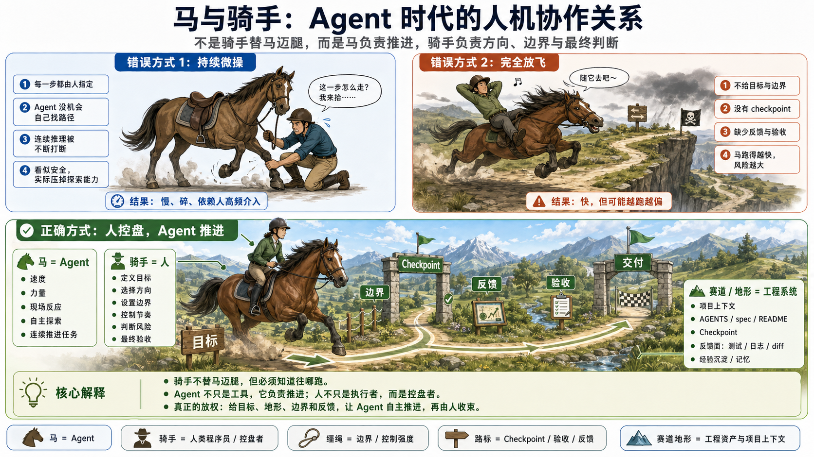

# Code is cheap. Don't write any.——AI Native 研发的控制面

过去，代码贵。写得慢，改得慢，重写更贵，所以工程师天然珍惜代码：追求复用、抽象、架构和长期可维护性。

现在，Coding Agent 可以读仓库、改文件、跑工具、修测试、反复验证。代码生产成本正在迅速下降，但工程任务并没有因此自动变简单。真正昂贵的东西换了位置：**目标是否清楚、上下文是否干净、边界是否守住、结果是否有证据。**

所以“Code is cheap”并不等于“工程纪律不重要”。恰恰相反：当代码像水一样大量涌入，工程纪律必须从逐行生产代码，上移到控制水往哪里流。



## 两个绕不开的事实

第一，大模型是概率系统。同一个任务可以走出不同路径，小偏差也会在长链路里累积。复杂任务不是不能交给模型，而是不能只靠一句大 Prompt，然后期待它一路正确到底。

第二，上下文不是越多越好。窗口再大，目标、旧结论、新约束和无关细节混在一起，模型也会逐渐失焦。真正要节约的不是 Token，而是上下文里的注意力。

这两个事实共同决定了一件事：我们需要的不是更多提示词，而是一套围绕模型搭起来的控制面。

## 水流理论：不要替模型挖完整条河

传统编程像挖水渠：路径先由人设计清楚，代码按确定路径运行。

和强模型协作更像治水。人不需要预先决定每一步，也不应该在每一行代码上微操。人真正需要做的是：

- 定义水最终应该去哪里，也就是目标和验收标准；
- 标出不能淹的地方，也就是边界、权限和风险；
- 在关键位置设置水闸，也就是 checkpoint；
- 发现方向不对时阻止、绕道或回炉；
- 到终点后检查结果和证据，而不是只听模型说“完成了”。

模型负责找路，人负责河床、闸门和验收。这就是 Harness 的核心分工。

## 最小混沌单元：每次只放出一段可回收的水

水流理论回答“怎么协作”，最小混沌单元回答“这次让模型跑多远”。

一个合适的任务单元应该同时满足四个条件：

1. 目标可以复述清楚；
2. 边界和明确不做的事情可见；
3. 模型可以自主完成一段有意义的闭环；
4. 人类可以用证据验收，失败后也能局部重来。

它不是越小越好。把任务切成几十个机械步骤，会重新把人变成模型的鼠标；把整个季度需求一次性交出去，又会让偏差失去控制。好的切分点，是**足够大，可以自治；足够小，可以验收。**


## Checkpoint 不是审批表演

Checkpoint 的目的不是让模型频繁停下，而是在风险真正变化的地方保留控制权。

模型到达 checkpoint 后，人通常只需要做六种动作：

| 动作 | 什么时候用 |
| --- | --- |
| 放行 | 路径合理、风险可控，继续推进 |
| 阻止 | 即将越过权限、安全或任务边界 |
| 绕道 | 目标不变，但当前路径成本过高或走不通 |
| 回炉 | 对目标、事实或方案的理解已经错了 |
| 追问 | 证据不足，不能判断是否应继续 |
| 加料 | 缺少一段关键上下文、日志或约束 |

低风险任务可以只在实施前和验收前设闸；高风险任务则要在数据迁移、权限变化、外部写入、发布和不可逆动作前增加 checkpoint。控制密度应该跟风险走，而不是跟流程模板走。

## Spec 是外部真相源，不是巨大 Prompt

Spec 的第一受众是人。它记录目标、边界、关键决策、当前状态和验收证据，让任务可以暂停、恢复、交接，也让团队知道为什么这样做。

对模型来说，Spec 是一个索引和注意力锚点。需要决策时读取相关切片，不需要每一轮把整份文档重新塞进上下文。稳定信息落在聊天外，活跃上下文只保留下一步真正需要的内容。

这也是为什么任务变长后，换一个干净的新对话往往比继续压缩旧对话更可靠：旧会话留下噪音，新会话通过 Spec 和 handoff 恢复事实。

## 质量控制正在上移

代码廉价以后，工程师的价值不会消失，而是从“亲手写出多少代码”迁移到更高的控制面：

- 工程师切任务、判断路径、设计验证；
- TL 定目标、边界和风险等级；
- 架构师设计 Harness、上下文入口和恢复机制；
- QA 设计端到端证据、回归、灰度与事故兜底。


“我不逐行看所有代码”只能发生在边界清楚、自动化验证完整、可灰度、可回滚的地形里。支付、权限、安全、数据删除、基础设施核心和缺少测试的老系统，仍然需要更高密度的人工审查。代码可以廉价，后果不能廉价。

## 四个入口，一套控制面

SDD-RIPER 把这套方法拆成四个互补入口：

- [`sdd-riper-one-light`](../skills/sdd-riper-one-light/)：日常默认 Harness，用最小 spec、checkpoint、验证和 reverse sync 控制任务。
- [`sdd-riper-one`](../skills/sdd-riper-one/)：适合训练、审计、复杂重构和高风险任务的显式重型入口。
- [`codemap`](../skills/codemap/)：把陌生代码整理成面向 Agent 的地形索引，避免无目的地吞整个仓库。
- [`new-chat-ready`](../skills/new-chat-ready/)：在新对话、长暂停和交接时生成可恢复状态，让任务摆脱腐烂的旧上下文。

如果只带走一张操作卡片，就是下面八步：

```text
1. 读地形     -> 历史 spec / AGENTS.md / codemap
2. 切任务     -> 足够自治，也能局部验收
3. 做任务包   -> 目标 / 边界 / 风险 / checkpoint / Done Contract
4. 让模型推进 -> 不微操实现路径
5. 关键处设闸 -> 放行 / 阻止 / 绕道 / 回炉 / 追问 / 加料
6. 用证据验收 -> 测试、日志、接口、截图、人工检查
7. 风险外移   -> 灰度、监控、回滚与独立 Review
8. 回写状态   -> spec / handoff / 项目知识
```

代码越来越便宜以后，真正稀缺的不是写代码的人，而是能让模型在正确边界里大胆流动，又能把端到端结果安全收回来的人。

下一步如何实际跑一个任务，见[《一套可复制的 AI Coding Harness 工作法》](./ai-coding-harness-guide.md)。
