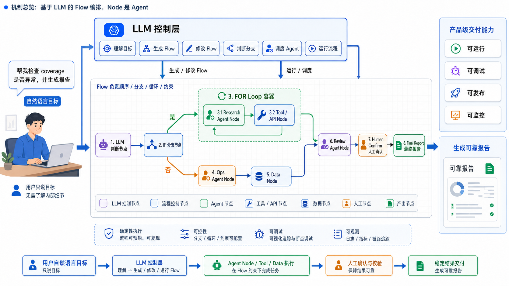

# 从 Agent Flow 到 AI Native：为什么通用Agent是饮鸩止渴

## Agent Flow

我最近一直在做一个小玩具：**Agent Flow**。

这个小玩具最初的目的很明确，就是想在某些特定场景和受众群里，取代现有的 Agent Skill。

这个 Flow 本质上是传统 Flow 的强化，但它的核心不是让用户理解节点、连线和 JSON，而是让用户用自然语言描述目标，然后让 LLM 去理解目标、生成 Flow、修改 Flow、运行 Flow。

Flow 本身的重要性也降级了，它只是一个编排层，不对 Node 和细节负责，只负责链路控制、任务下发和结果回收，具体的任务由 Node 负责。这里的 Node 可以是 ToB Agent，可以是 Codex CLI，可以是影刀，可以是千牛接口，也可以是内部运维 Agent，整体的核心理念就是把任务切分下发，然后让节点负责执行。

举个很具体的 case：一个电商用户要汇总报表，他要通过 ToB Agent 拿一些数据，通过影刀 RPA 拿一些数据，通过千牛的接口拿一些数据，最后汇总三份数据，然后通过钉钉 CLI 写到钉钉文档，再把文档发到钉钉群。以前我们给 ToB Agent 写 Skill 的时候，几乎不可能单独在一个任务 loop 里完成这个长链路，但是 Agent Flow 确实可以实打实地、无介入地直接跑通这个 case。

它不像一些通用 Agent 那样，把一切 all in 在通用能力和 LLM 上，不幻想着做出一个 world agent，也不幻想着只要给 Agent许愿就可以解决一切问题。它只是把一整条任务链路拆成合适的 Node，然后把任务外包给合适的 Agent Node，跳出单个 Agent，上升到编排层和控制层，把 Agent 作为能力之一，而不是把 Agent 当成一切。

为什么要做这个？因为在现在这个潮起潮落的大模型时代，通用能力、智能助手、架构设计这些名词都太泛滥了。无数用户抱着期待来使用你的产品，然后在 Agent 左顾右盼的通用升级过程中迟迟等不到想要的结果，最后放弃，转投竞品。大量客户想要的，明明只是完成一些重复任务。这些任务有固定的流程和链路，只在某些节点需要用 Agent 取代部分操作（比如导出数据，比如整理文案，比如分析结果）。使用 Flow 结合 Agent，可以快速高效地帮助客户解决困难，让用户不必在难以理解的 Skill 和漫长等待 Agent / LLM 自有能力升级之间来回折腾，能真实的把用户留下来。

## 最小任务单元和确定执行

Flow 分发任务给 Agent Node 这一套逻辑，其实和我一直推崇的“最小任务单元（最小混沌单元）”理念非常契合。

由于大模型的输出本质上是概率性的，且上下文窗口有限，因此我们每次派发给大模型的任务，都最好是一个有具体上下文、工作量适中，并且可以闭环确认结果的单元。

在 Agent Flow 里，Flow 的每一个 Node 就是这样一个最小任务单元。这些 Node 可以是让 ToB Agent 执行某个动作，也可以是呼叫外部的 Codex 处理某段逻辑，做完之后再进入下一个节点。这种做法不仅让庞大复杂的任务变得受控，还能极大地拓展系统的编排能力。

更重要的是，**YAML、Flow、hardcode 是可靠的，而纯自然语言是不可靠的**。基于 YAML 的 Flow 自生成和自维护，远比松散的 Skill 简单高效。

你如果深度用过现在的通用 Agent 就会知道，同一个任务你开两个不同的对话，它很可能会用两种完全不同的思路去做，然后一个成功，一个失败。

而业界是怎么试图解决这个问题的？靠堆砌“记忆（Memory）”系统。这就可笑地落入了一个更大的沼泽里——我相信到现在为止，也没有哪个通用 Agent 敢说自己的记忆系统已经牛到能彻底解决问题，让所有用户满意。

而同样的，用户要的根本不是大模型像程序员解 bug 一样去“探索”路径，用户要的是：**用最低的认知负担，确定地、可靠地完成复杂任务**。

## 用户为什么用你的 Agent？

综合以上的认知，我们可以回归到一个很现实的问题：外面成熟的大模型那么多，用户为什么要用你的 Agent？

原因只有两个。

### 第一，只有你能解决某些问题

不要迷信框架的先进性。在 LLM 时代，写一个优秀的 Agent 架构并不难。真正关键的是，你拥有别的 Agent 拿不到的东西。

在过去十来年，爬虫技术和反爬对抗了很久，本来这一套东西似乎已经在渐渐被淡忘了。而随着 LLM 的兴起，我突然发现，爬虫、数据获取又开始变得炙手可热起来——因为大模型如果没有正确且核心的数据，充其量只是个聊天的 Chatbot。不仅无数 LLM 在训练阶段需要数据，还有更多实际需要落地的 Agent 在执行阶段也需要真实的数据。

最经典的例子就是之前的“AI 前女友”。看起来很蠢，但大家趋之若鹜；然而真正能做好的人寥寥无几。为什么？因为你很难拿到完整的微信聊天记录——腾讯在这个方面一直都是严防死守，你永远无法让 LLM 完美地复刻你的前女友。

同样的道理，淘宝的商品数据、钉钉的聊天记录，这些才是 Agent 最宝贵的财富。哪怕通用模型再聪明，它也做不到突破安全限制进入到我们的数据库里，然后“自动总结聊天记录，精准推送到指定的钉钉群里”，只有能够拿到独一无二的数据和接口的 Agent 才能做到。

所以，在 LLM 时代，谁有真实的高质量数据，谁能够背靠核心的产品和功能，谁就能做出来独一无二的 Agent，谁就能成为唯一能解决独特问题的 killer。

### 第二，你真的能解决问题

这句话听起来像废话，却是很多 LLM 产品最容易本末倒置的地方。

搞一个华丽但没用的通用 Agent，然后洋洋得意地对外宣称自己用了 RAG、MCP、Tool Calling、Multi-Agent、Agent Loop……这些对用户来说毫无意义。

用户只关心一件事：**我的问题解决了吗？**

很多客户的真实需求，其实只要三个有顺序的 LLM Call 加上两个 API 就能解决。但现在的很多产品，非要上一堆通用能力，搞各种复杂的 Loop，要不就是烧掉大量 token 换来一堆客诉，要不就是任务根本无法复现成功，完全变成了一次性的功能。

而现在很多 Agent 就是要野心勃勃：我们要做超级智能助手，我们要解决一切用户遇到的问题，我们要构建数字员工直接取代用户本身——这些想法太宏大也太可笑。world agent 和 world model 一样，都是可望而不可即的。这个目标或许积极，也值得追求，但是在这个漫长的过程中，难道我们就要放弃用户大大小小的具体问题了吗？如果客户有问题，或者业务团队有问题，难道就要一边玩去，不要打扰架构团队的星辰大海吗？

Agent 的核心不是架构，不是 loop，不是 harness，而是用户是否愿意为它解决的问题付费。只要你可以解决问题，用户根本不在意你是什么架构、什么技术，是不是用了 hardcode，是不是在服务器安插了几个脚本——他们甚至不在意你用的是不是 LLM。只要你可以解决他的问题，他就愿意掏出真金白银。只有客户掏出真金白银，你的 Agent 才算成功，你的老板才会给你好脸色。

豆包做得不好吗？月活不多吗？当然不是。但是为什么会有这么多豆包笑话，为什么大家会嘲弄豆包收费这件事？因为很多用户觉得豆包“解决不了问题”。当然了，豆包团队内部肯定也很别扭。他们不是做不出来更高智力的模型，只是作为一个用户量巨大的免费产品，高智力本身就是纯粹的负担（经典前司字节笑话）。

所以它不得不陷入一个奇怪的沼泽里：做得太聪明，成本扛不住；做得不够聪明，用户又觉得你解决不了问题。那追求一个所谓超级产品的意义真的大吗？追求通用 Agent 真的是好事吗？如果豆包都陷在这个沼泽里，我们为什么还要继续跟着这些车辙走？

通用 Agent 看似美丽繁华，其实是**莽牯朱蛤**，如果你功力深厚，自然可以打通任督二脉，但是对于普通人来说，却是剧毒之物。现在市面上、部门里、团队中，像魔鬼的低语一般不断涌现出“做一个通用 Agent”的声音，在我看来无异于那句\*\*“鸡汤来咯”\*\*——它并不是想给你鸡汤喝，它只是想炸死你。

## Hardcode 是美丽的

在我眼里，通用 Agent 远不如 hardcode 美丽，因为对我来说，美丽的定义就是客户愿意掏钱。在解决用户需求的赛道上，很多时候明明用户的需求很朴素，我们却不愿意去用一直以来的终极解法：**Hardcode**。

我们排斥 Hardcode，是一种强烈的惯性，因为过去人工写代码的成本高，写一段定制逻辑有成本，维护它有成本，未来扩展也有成本。所以大家追求抽象、追求通用、追求平台化，那时候好像只要为某个客户写了 if else，就显得很土，很不高级。

但在 LLM 时代，这个前提变了。代码是廉价的。写一个 Flow 是廉价的。写几个固定的 LLM Call 是廉价的。给一个付费客户手搓一条 Agent Flow，也是廉价的，那为什么不 hardcode 呢？我可以这样说，hardcode 非常美丽，因为代码维护者变成了 LLM，而对 LLM 来说，10 个 if else 绝对比一大堆抽象工厂要更容易理解。

如果一个客户的问题，就是三个有顺序的 LLM Call 加两个 API 就能解决，那就这么写。如果一个客户的需求，就是一个很固定的审批辅助链路，那就写死。如果一个客户愿意付费，只是想让系统每周帮他生成一份可靠的报告，那就给他做一个可靠的 Flow。

因为用户的问题被解决了，用户就愿意付费，我们的成本也被覆盖了，系统也有机会从一个真实场景里继续生长出来。相比之下，问题还没解决，客户还没付费，就先在那里设计一个通用 Agent 平台，搞一堆 Loop、Memory、Harness、MCP、RAG，最后用户用不起来，成本也压不住，这才是真的可笑。

这也是我为什么要做 Agent Flow 的原因。它不是为了证明 Flow 比 Agent 更先进，而是因为 Flow 可以承接这些真实、具体、甚至有点 hardcode 的用户需求。它可以把 if else、LLM Call、Agent 节点、业务接口、人工确认这些东西编排起来，让它们变成一条可靠的任务链路。招几个人让他们去编排 Flow，不比让他们写 Skill 要更美丽吗？

## AI Native / LLM Native

“AI Native”这个词被行业翻来覆去炒了几个月，大家不断试错，直到热度渐渐降温，似乎依然没有摸清它的门道。

其实 AI Native 的本质非常简单：**基于 LLM，让 AI 解决用户的问题**。

不是让产品看起来有 AI，不是让架构看起来先进，也不是让用户学习 Agent、Loop、RAG、MCP。用户真的有一个问题，AI 真的帮他解决了，而且解决得更轻松、更可靠、更便宜，或者至少更自然，然后用户愿意继续用，甚至愿意付费，这才是 AI Native。

现在的很多东西更像是旧系统突然看见了大模型，然后赶紧往自己身上贴了一层 AI 的皮。旧框架还是旧框架，旧流程还是旧流程，只是某个环节多调了一次 LLM，某个页面多塞了一个聊天框。

举个直接的例子，很多 AI 搜索，就是把 LLM 通过各种别扭的方式接入推荐系统，就是典型的 LLM 套皮；而快手 [OneRec](https://arxiv.org/abs/2502.18965) 这种直接搞一个原生的推荐大模型，才更接近真实的 LLM Native 方案（这里并非赞扬快手 OneRec，只是举一个 case，毕竟他们也没真的搞成）。

随着 LLM 的普及和推广，越来越多用户开始习惯用自然语言和 LLM 交互。甚至以后会出现某种“LLM 新生代”，取代过去的“互联网新生代”。当你的用户本身就是 AI Native 的，你的产品自然也需要是 AI Native 的。用户可能不懂 loop、memory、RAG、MCP，但用户不是傻子。他不知道你的技术理念，但他知道好不好用、靠不靠谱、值不值得付费。AI Native 的产品，就是基于大模型，对产品交互、业务流程、对客服务进行重塑。用户已经在变成 AI Native，产品当然也要跟上。

我们需要秉持一种强硬的态度去砍掉所有挡路的东西，脑子里只留一个念头：**用户的一句自然语言，到底能不能把这个任务完整跑通？**

基于这些，我再强调一次：所谓 AI Native，不是那些看起来很带劲的过程，而是你是否能从 LLM 出发，以降低负担和提高易用性为目标，让自己的东西更可靠地为用户服务，真实地解决用户的问题，并且让用户愿意为此付费。

## 程序员的自我修养

把视角切回研发侧，理念依然是相通的。技术引入 LLM 的目的就是：**提效**。

如何提效？把所有挡路的流程、审批、权限统统干掉，用最好的模型和 Code Agent，让 LLM 真正参与到写代码、测试和发布的链路中。

我之前在写一个类似阿里内部运维 Agent 的 WarRoom 研发助手项目时深有感触。当时它的目标是自动化接收告警、分析问题、写代码提 PR，也就是程序员的 LLM 助手。

项目快写完时，我却放弃了。为什么？**因为现在的基建根本不支持这套系统**。

*   我想让它查日志，但日志系统需要人工授权，且无法 A2A。

*   我想让它看代码，代码库需要手动开权限。

*   我想让它管理中间件，但中间件没有开放 AK/SK 管理。

*   我想接入更强的模型，审批却批不下来，外部模型也无法访问内网。

每一步都在受阻，最终勉强搞出的 Demo 只能管理 3 个应用，只能接入受限的模型，导致我不得不痛苦地保持“人在回路”。

那个时候我最强烈的感受不是“模型不够聪明”，而是我又变成了人肉胶水：Agent 说要查日志，我去点；Agent 说要看权限，我去申请；Agent 说要验证结果，我去切后台、截图、复制，再喂回去——原因很简单，过去 20 年所有的基建都是为“人类”设计的，不是 LLM friendly 的，自然处处都是别扭。

不仅我无法做出一个真实的超级程序员助手，我自己也无法通畅地成为一个“自由人”，我只能被按在既有的框架里：如果厨房的台盆只有这么大，你的水龙头无论多么高级、猛烈，最后那些水也只会进入下水道。

但是，可喜可贺，内部研发平台团队把内部运维 Agent 做出来了——和我的想法几乎如出一辙：把日志、trace、代码等东西直接喂给 Claude Code（我 WarRoom 的执行器就直接用的 Claude Code，比自己写 Code Agent 要高效一万倍）。这个 Agent 只花了一秒钟就证明了：只要基础设施对 LLM 足够友好，模型和 Agent 就可以进入研发现场，帮你修 bug、写需求，成为你的超级助手。

不得不嫉妒地说，这个内部运维 Agent 的位置天生就好，它可以更简单地拿到更多权限，获取更多基建，通过更多审核。毕竟这就是 location 的重要性，这也是我之前提到的“只有你能解决某些问题”。

> 塞两句我爱的私货，太契合这个场景了：
> ● Power is a lot like real estate. It's all about location, location, location.
> ● Money is the McMansion in Sarasota that starts falling apart after 10 years. Power is the old stone building that stands for centuries.

当然了，作为一个独立的程序员，我只能研究使用某些 Code Agent 写代码的方法论，去写一些无关痛痒的文章。一些更深远、更重要的层次，比如基建，比如权限，我没有权利发表什么言论。但是我知道，一切的阻碍必然会被消灭，大模型就是一辆带着推土铲的 Leopard 2 A8，会消灭面前的一切，这只是一个谁快谁慢的问题，而在这种问题上，我不建议我们继续落后。

## 一千张 A4 纸叠起来依然是厚的

既然提到了基建和权限，就不得不聊聊组织架构。在过去的一年里，我发现自己越来越像一个 **Master Agent**。我处于一种持续接收任务的状态，然后把任务拆解分发给我的 Sub-agent（比如 Codex、Claude、Qwen）去执行。在这个状态下，谁给我派活根本不重要，重要的是**任务的上下文是否完整**。

只要信息给够，大模型就能很好地接住。但如果是需要反复拉会、反复和人确认的任务，或者是一个局部但很深、需要大量交互和判断的任务，我和我的 Sub-agent 都会极其痛苦。当前的组织架构和任务流，对 LLM 是极度不友好的。

扁平扁平，互联网喊了很多年，在 LLM 时代，它终于变成了不得不侧目的房间里的大象。一千张 A4 纸叠起来依然是厚的。组织也是一样，层级再怎么包装成扁平，只要任务、权限、上下文和反馈的链路很长，它就还是厚的。我以前看过一篇文章，里面有一张照片，是美团的王兴站在一个巨大的平层工区里办公，周围有几百个员工，那篇文章夸美团“扁平”。我当时就觉得有点可笑，现在回头看更可笑。

真正的扁平，不是物理空间上离得近，而是组织的链路足够短。我离王兴近一点，并不能让我从他的钱包里分到任何一分钱，但是如果需求的沟通少一个转发人，我就会对原始内容清晰多一倍。一个想法从上面到一线，需要经过多少层转述？一个需求从 PM 到开发，需要经过多少次解释？一个权限从需要到拿到，需要多少张工单、多少次私聊、多少个审批？这些才是扁平不扁平。

我认为最理想的状态是：每个人都可以成为“超级自由人”。不被部门和权限限制，只要看到任何东西有问题，可以直接开始写代码，然后提交推送部署并且全权地为这件事负责。任务分发者则可以直接点对点对接，CEO 可以直接把一个完整任务交给一线研发，而不是需要层层派发。隔壁的产品也可以直接打开我的对话窗口，输入一部荷马史诗，让我赶紧把一个东西做出来。虽然以上的观点非常激进，但是在一些小规模的创业公司，这一套是常态，我觉得在美国 Anthropic 和 OpenAI，这些内容也正在成为现实。

当然了，这些只是狺狺狂吠。我没有什么太多的资格讨论组织架构，我没当过 CEO，最多只是一个小组长，我本质上还是 too simple，太理想。但是从一个 LLM-based 研发的角度出发，我觉得重点不是干掉多少中层，也不是要一线 lead 提效（字节笑话\*2），而是把人做成“Agent”，把任务和交流变成 TCP/IP 协议，点对点，可靠，稳定，充分。当我和 Agent 可以一次性拿到所有需要的上下文，那么任务就会变成极度简单的 goal 模式。当然了，这一点太过理想主义，但是从现在做起，而且不学习坏榜样，绝对有利无弊。

## 可笑的测试转开发

在我的很多篇文章评论区（主要是 harness 的评论区），很多人都在提到一个问题，那就是我们都用 AI 写代码了，会不会把老项目击垮？虽然这一点最近几乎没人提了（因为大家都开始用 all in LLM 写代码了），但是这个问题的根并没有被解决。

怎么解决这个问题？我的答案是：**测试同学**。

所以我对字节跳动此前让测试全员转开发的做法完全嗤之以鼻（字节笑话\*3）。在这个人人都能疯狂生成代码的时代，code 比卫生纸还廉价，但是系统仍然需要可靠，需要 99.99，需要没有线上事故。

那么测试环境、自动化回归测试、真实的测试 case、端到端的手点测试不仅不应该被取消，反而应该引入更多、更专业的测试人员。测试同学就好像是最后一道堤坝，LLM 洪流前的东西要么已经被冲垮了，要么已经被我们主动拆除了。只有测试同学，只有他们，才能在 LLM 对代码仓库的 DDoS 面前保证淘宝可以买东西，支付宝可以付款，钉钉可以发一句“收到”。

所以，应该是开发兼任测试，而不是测试转成开发。字节跳动还是 too young too simple，我不希望阿里也学习他们。

## 回到 Agent Flow

最后，我们回到最初的问题：我为什么要做 Agent Flow？

不是为了做一个架构更复杂的 Agent 系统，不是为了证明 Flow 比 Skill 先进，更不是为了生造一堆技术黑话去绑架用户。

**在 LLM 时代，Agent 的方向绝对不是花里胡哨的技术名词和复杂通用的架构设计，甚至通用 Agent 都不是一个恰当的目标。**

直接从用户问题出发，哪怕是 hardcode，哪怕是 if else，哪怕是几个固定的 LLM Call，只要它能帮助用户在 LLM 的汹涌洪流里更简单、更可靠地解决问题，它就是好的方案，就是一个 Good Agent，这也是我为什么要做 Agent Flow 的原因。

放弃高大上的名词，放弃那些让人痴迷的技术架构，认真地和用户聊一聊，多和这些下沉客户开开会（而不是总是和研发开会）。是的，他们好像确实没有追上世界的主流，但是他们愿意给你付费，愿意给你白花花的金钱，愿意为你消耗的 token 买单。

从现在开始，去设计和开发一个可以解决他们问题的 Agent，无论多么丑陋和 hardcode，而不是在无尽的技术名词里潜泳，那样只会被溺毙。
