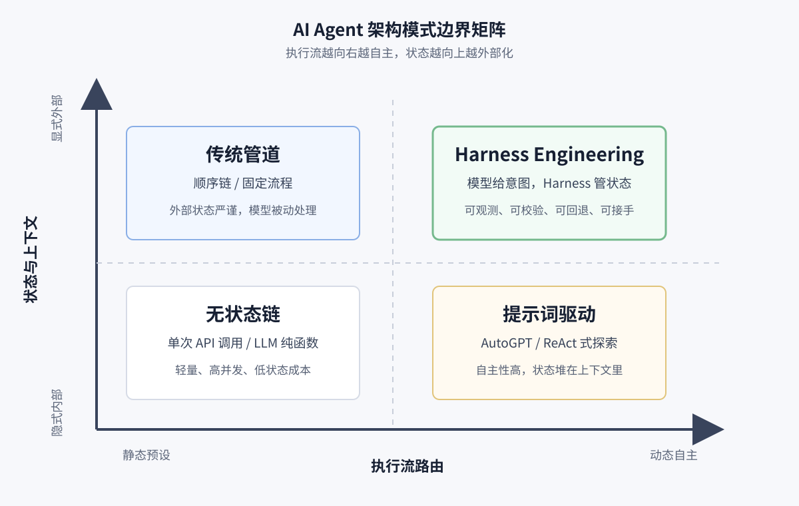

# 从玩具到生产力：用真实项目讲透 AI Agent 的 Harness Engineering

> **一句话版**：这篇文章不讲 Prompt 技巧，也不推销某个 Skill，只想说清两件事——**在企业工程环境里，如何把大模型 Harness（约束与治理）成一个能持续参与交付的协作者；以及大模型时代，程序员为什么正在从“亲手写代码的人”迁移成“定义目标、控节奏、做验收的人”。**

过去一年，行业里关于 AI Agent 的讨论集中在两个方向：比模型能力，切磋 Prompt 写法。这些当然重要，但当你想把 Agent 用到企业内部的工程环境时，会发现：决定成败的往往不是 Prompt 写得多妙，而是 Harness 做得多扎实。

Harness 不是某条提示词、某个工具，也不是多写几份文档。

**它是一整套把大模型纳入工程体系的控制面**：如何提供唯一的真相源？如何约束执行边界？如何接入业务能力（Capability）？如何观测、调试运行状态？如何让产出可验证、可回归，让其他工程师能接手？

在做一个真实工程案例时，我对这件事感受直接。项目初期，我们没有急着"写一个发请求的 Agent"，而是从读架构文档、收敛目标、迁移参考实现开始；推进过程中，上下文断裂、Tool 耦合、接口 504/403、本地测试直接退出……这些工程摩擦一个接一个。

复盘下来，能不能跨过这些坎，和"换个更聪明的模型"关系不大，关键是我们在哪些节点成功搭建了 Harness。

这篇文章想分享两个互相咬合的判断：今天的大模型已经够强，可以参与研发交付；但没有 Harness，它充其量是个高级玩具；有了 Harness，它才能成为研发链路中的协作者。也正因为如此，程序员的核心价值会开始迁移：从“亲手写出每一行代码”，转向“定义目标、卡住边界、掌控节奏、验收结果”。

再往前推一步，这两件事其实不是并列关系，而是因果关系：**正因为大模型时代的程序员必须学会放权，不能再把所有实现都攥在自己手里，所以才必须先建 Harness；也正因为 Harness 建起来了，这种从执行者走向控盘者的身份迁移才真正变得可行。**

## 一、Harness 到底在管什么？和传统软件工程有什么区别？

很多同行第一次听到 Harness，反应都是："加测试、看日志、写规范、Code Review……这不就是软件工程的良好实践吗？"

如果只是这样，没必要造新词。要理解 Harness，得先划清一条边界：

**传统软件工程管的是「确定性」，Harness Engineering 管的是「非确定性」。**

传统软件工程是为人类设计的防呆系统——我们有常识，但容易手滑敲错代码。一个 `add(a, b)` 函数，只要代码没 bug，结果永远确定。但大模型是概率引擎，同样的输入，它可能直接返回结果，可能调一个不相干的 Tool，也可能因为前文的某句话"幻觉"暴走。

所以 Harness 不是泛泛的"好习惯"，它是为了把一台「聪明但没有工程常识的非确定性引擎」嵌进「确定的业务流水线」而设计的物理控制面。

如果用更通俗的话讲，Harness 很像你在带一个刚加入团队、能力很强但还不稳定的“数字员工”。你不会一开始就站在他背后盯着每一行代码怎么写，而是先把任务目标、边界条件和验收标准说清楚，让他先半自动地跑几轮：自己写、自己测、自己看日志、自己改。你主要盯的是结果、进度、卡点和风险，而不是深度介入每一个实现细节。等跑顺了以后，再把原本很多需要人手动处理的事情——比如配置、日志、消息、部署、发布——逐步交给 Agent 接管。

当然，大模型并不真的等于一个人类工程师。人天然有常识、长期记忆、责任感和风险感，而 Agent 没有这些，它更像一个需要外部脚手架、验证器和门禁系统托着跑的数字员工。所以，“像带人一样带 Agent”是一个很好理解的比喻，但前提是你已经把状态、验证、审批和回退机制搭好。

## 二、架构坐标系：Harness 的边界在哪？

我们用两个坐标轴来界定 Harness Engineering 的边界：

1.  **X轴（执行流路由）**：**静态预设** vs. **动态自主**——下一步干什么，是代码写死的，还是大模型决定的？

2.  **Y轴（状态与上下文）**：**隐式内部** vs. **显式外部**——系统的记忆是塞在 Prompt 窗口里维持，还是由外部数据库/状态机接管？

基于这两个维度，可以画出 **AI Agent 架构模式边界矩阵**：

**四个象限没有绝对优劣，只有场景适配。**

*   **【象限三：无状态链】**：如单次 API 调用，把 LLM 当纯函数。轻量、高并发，适合一次性翻译或海量情感分类，低成本高吞吐。

*   **【象限二：提示词驱动】**：如 AutoGPT、原生 ReAct。模型自主性高，中间步骤全堆在 Prompt 里。适合探索性问题、创客试错、短链路任务，开发成本低。

*   **【象限四：传统管道】**：如 LangChain 顺序链。外部状态管理严谨，模型只是被动调用的"处理节点"。适合流程固定、只需 LLM 处理非结构化数据的场景。

*   **【象限一：Harness Engineering】**：模型提供意图，外部 Harness 负责状态隔离与沙盒校验。开发成本相对高，但当业务碰到上下文容易爆满、接口容易报错、需要团队接手维护这些痛点时，它能用合理成本换一个更稳的系统下限。

## 三、避坑指南：识别"伪 Harness"与"劣质 Harness"

有了象限图，就能戳破一些常见的架构错觉。很多团队陷入混乱，是因为没分清\*\*"是不是 Harness（边界问题）"**和**"是不是好做法（质量问题）"\*\*。

### 错觉 1：根本不是 Harness，而且是坏做法（伪 Harness）

这类做法试图在单次对话的上下文（象限二）里解决所有问题，模型之外没有物理约束。

*   **"软约束"陷阱**：在 Prompt 里写 5000 字、几十条 `DO NOT`。这只是"口头嘱咐"，长链路中容易被遗忘。Prompt 是指令，Harness 是约束——前者在模型脑子里，后者在模型外面。

*   **"军火库"陷阱**：一股脑给 Agent 塞 20 个 API 让它自己挑。没有边界约束，危险调用迟早会发生。

### 错觉 2：是 Harness，但质量很差

建立控制面确实算 Harness，但不代表它"好"。粗暴的控制同样会出问题。

*   **"盲打"陷阱（暴力死循环重试）**：外层套个执行器，一报错就把 Error 塞回模型让它继续试。这确实是控制流，但裸奔的 Loop 容易让模型陷入死胡同——为了修一个语法错，把核心架构全删了。

*   **"官僚主义"陷阱（强制重型文档流）**：生搬瀑布流，强制模型先输出万字设计文档才能写代码。这确实是状态管理，但浪费 Token，而且现实一变，巨型文档立刻变成没人维护的垃圾。

### 好的 Harness 应该是什么样？

*   **前置验证（Evaluator 沙盒）**：单测失败时，把日志抓给 Agent，在沙盒里基于证据触发 Retry，修 Bug 前强制复述"核心目标"。

*   **最小真相源（Spec is Truth）**：维护一份轻量的状态机文档，为的是任务跨天时能无损恢复上下文。

*   **物理门禁（Checkpoint Before Execute）**：用系统级审批节点作为刹车，模型破坏现有环境前必须拿到授权。

这里还有一个很容易被误解的点：**“逐步降低人的参与度”是 Harness 的结果，不是 Harness 的定义。** 真正的关键，不是表面上看起来有多自动，而是这套系统是否可观测、可校验、可回退、可接手。换句话说，Harness 的本质，不是让 Agent 自由发挥，而是把原本依赖人脑临时盯着做的监督、纠偏、验收和交接，工程化成一个可以反复运行的外部控制系统。

## 四、为什么企业环境里 Harness 比 Prompt 更重要？

做本地 Demo，很多缺陷可以被掩盖：人工随时兜底，一次性塞满上下文硬扛，或者靠模型某次"超常发挥"。

但企业工程环境容错率低：**链路长、边界严（涉及鉴权与权限边界）、试错成本高**。Agent 面临的挑战不再是"能不能写出漂亮代码"，而是：调的是不是正确的接口？执行失败时能不能自己读日志定位问题？上下文能不能被人类随时接管？这些问题，Prompt 写再长也解决不了。

这也会带来一个非常现实的身份迁移：**大模型时代，工程师的核心价值正在从“亲手写出每一行代码”，逐步迁移到“定义目标、卡住边界、掌控节奏、验收结果”。**

很多人第一次接触 Agent，会本能地把自己放在"资深程序员"的位置上，担心模型到底每一行代码是怎么写的、内部细节是不是完全符合自己的手感。但如果你真的把模型当成一个高速执行者来协作，你的角色会越来越像一个**技术负责人 / 交付负责人**：

*   你不需要逐行干涉它怎么落代码。

*   你更需要盯住它要交付什么、当前阶段目标是什么、风险点在哪里、验证证据够不够。

*   你不需要每个细节都亲自下场实现。

*   但你必须随时能在关键架构、关键边界、关键异常上快速下潜，重新接管方向盘。

换句话说，Harness 并不只是"把模型管住"，它也在逼着人类工程师升级自己的工作方式：**从执行者，变成控盘者；从写代码的人，变成能带着非确定性系统一起交付的人。**

这里特别容易有一个误区：把这种迁移理解成"以后程序员只要像老板一样甩活就行"。这并不准确。更准确的说法是：

**你可以不再亲手写大量代码，但你不能放弃技术判断。**

真正强的 Harness 使用者，不是完全不看代码的人，而是知道什么时候不必盯细节、什么时候必须下潜检查的人。他日常不需要干涉模型怎么写每一个函数，但在下面这些时刻一定会亲自接管：

1.  架构主线可能被污染时。

2.  阶段目标开始漂移时。

3.  运行时日志暴露系统性异常时。

4.  模型把"阶段完成"误报成"全局完成"时。

所以从团队视角看，Harness 的价值不只是提高模型利用率，它实际上也在重塑工程师角色：**让最有经验的人，从重复实现中抽离出来，把精力集中到目标建模、过程控盘、关键抽查和结果验收上。**

换句话说，**要完成身份迁移，就必须学会放权；要安全放权，就必须先建 Harness。** 这正是我理解的 Harness 在大模型时代最根本的现实意义。

## 五、真实工程案例：一个 AI Agent 是怎么被 Harness 出来的？

这个案例的演进过程，打破了"给一段神仙 Prompt，Agent 就能长出整个系统"的幻想。真实情况是一步步把裸奔的模型拉到既定轨道上。

**1. 起步阶段：先收敛目标，不急着编码**

最容易踩的坑是一上来让 Agent 写具体功能。在这个案例里，我给的第一条指令是：_"这个项目是一个空的 Python 项目，请阅读架构设计文档，了解我想做什么，然后向我复述需求并讨论。"_ 这是 Harness 的第一层：收敛目标与边界。

**2. 连续开发阶段：用 Spec 和 Handoff 对抗上下文腐烂**

开发日志里，很多轮对话的开场白都是：_"请阅读_ `_YYYY-MM-DD_Chat_Handoff.md_` _恢复任务上下文。"_ 单轮 Prompt 装不下"昨天做了什么、为什么这么做"。Spec 和 Handoff 构成 Agent 的"外部持久化记忆"，防止认知漂移。

**3. 执行阶段：将 Prompt 溶解进 Capability 框架**

处理复杂业务时，我直接问模型："先召回再喂模型，还是一次性全喂？" 很多人把 Capability 想得玄乎。在我们的工程形态里，**一个 Capability = 一小段专属 Prompt + 一段确定的 Python 脚本 + 一个 Validator。** "将 Prompt 溶解进路由"的意思是：不再用几千字 Prompt 穷举分支，而是把分支拆成独立的 Python 管道（如 `pipeline_two_stage.py`）。Agent 执行前做一次轻量路由决策，决定数据倒进哪个管道，而不是在巨大提示词里靠概率"猜"。

**4. 运行阶段：跨越"能聊"与"能跑"的分水岭**

Agent 接入真实环境后，迎面而来的是 Chat 接口静默退出、504 超时、403 拦截。处理方式不是调 Prompt 语气，而是引导 Agent：_"先把 Chat 接口这条 SSE 链路找出来，看哪里会在没有文本输出时直接收尾。"_ 把问题转化成可诊断的链路排错，是跨越这道坎的关键。

**5. 交付阶段：让测试与回归前置化**

Agent 执行前会主动确认：_"我先确认测试入口和构建方式，然后只跑最合适的单测，避免高开销动作。"_ 测试不再是收尾动作，而是工作轨道本身。

把这套做法压缩成一句话：**我不是把大需求整包丢给模型等它"神奇做完"，而是持续对齐阶段目标，要求它复述目标、检查偏差、提交中间产物；完成一个阶段后再 Review、提测、手动验证，把真实日志喂回模型继续收敛。**

Harness 的价值不是"让 Agent 更自由"，而是让人类始终握着方向盘，把非确定性执行压缩成可验证、可回退、可交接的小闭环。

这里还有一个在真实落地中经常被低估的问题：**如果没有一套最小可用的评测和验收机制，很多所谓的 Harness，最后都会退化成人工盯盘。** 也就是说，Agent 虽然能自己写、自己改、自己跑，但“到底算不算做对了”仍然只能靠人肉判断。这样它最多只是一个高配的半自动助手，而不是一个真正能稳定交付的系统角色。所以，测试、日志、环境反馈和结果校验之所以重要，不只是为了 Debug，更是为了把“怎样算成功”从人脑里逐步搬到系统里。

## 六、实施层骨架：`sdd-riper-one-light` 扮演什么角色？

先澄清层级关系：SDD（Spec-Driven Development）是人机协作的「方法论」与「工具」，Harness 是承载它的底层「架构」。

Harness 提供物理基础设施——沙盒环境、运行时日志收集、能力路由。sdd-riper-one-light 是跑在这套架构上的实施协议与工具骨架。

从 Harness Engineering 的视角看，**大模型本质是一个聪明但高度非确定性的函数**。`sdd-riper-one-light` 的作用是运用**契约式设计（Design by Contract）**，把这个非确定性引擎夹在确定性管道里。

它的四个控制点对应三大契约：

1.  **前置断言（Pre-conditions）—— 拦截输入端失控**

    *   **强制 Checkpoint 与 Restate First**：执行高危代码前，模型必须复述核心目标、下一步动作和风险。断言没通过批准，函数拒绝执行，打断"盲目滑行"。

2.  **后置断言（Post-conditions）—— 拦截输出端幻觉**

    *   **闭环回写（Reverse Sync）**：完成动作后，不能由模型主观宣布成功，必须通过测试与日志等外部证据交叉验证。验证通过后，把结论与残留偏差回写。

3.  **不变式（Invariants）—— 对抗跨周期状态腐烂**

    *   **维护最小真相源（Spec is Truth）**：强制维护一个精简的 Spec 记录目标与结论。无论模型内部 Context 怎么滚动遗忘，这份外部 Spec 是整个生命周期中不容篡改的"不变式"。

总结：Harness 提供底层轨道，sdd-riper-one-light 是跑在轨道上的工具，用前置、后置和不变式契约锁住非确定性引擎的每一步。

## 七、行业印证：Harness 正在成为顶级团队的共识

当 Agent 走向生产环境，顶尖团队最终都会抛弃"Prompt 调优"，走向 Harness Engineering。

1.  **OpenAI Engineering：代码仓库成为唯一记录系统**

    OpenAI 内部用 Codex 端到端生成应用时，核心结论是"情境是稀缺资源"。他们放弃用巨型 Prompt 掌控一切的想法，把代码仓库（`docs/` 下的结构化文档）作为记录系统，人类转变为搭建 Harness 轨道的"环境设计师"。

2.  **Anthropic Labs：用 Checkpoint 对抗长任务失控**

    Claude 团队设计长时自治编程框架时，在 Harness 中引入强制的 Context Resets，通过结构化工件在会话间交接状态；同时剥离执行者与验证者，用独立浏览器的 Evaluator Agent 提供外部客观真相。

3.  **字节跳动：**`**deer-flow**` **的自动化沙盒**

登顶 GitHub Trending 的 `deer-flow` 明确自称 **"Super Agent Harness"**——把模型"大脑"与执行环境物理隔离，提供独立 Docker/K8s 沙盒；能力边界沉淀为按需加载的 `SKILL.md`；底层用 LangGraph 状态机编排子智能体。

底层哲学相通：**想释放大模型的生产力，第一步是先建好约束和轨道。**

## 八、如何从 0 到 1 落地？

如果准备在团队内部落地 Agent，建议按以下路径走，警惕"全自治"陷阱：

1.  **先搭真相源**：建立 Spec 和状态文档机制，别让上下文只存在于聊天窗口里。

2.  **约束执行边界**：业务闭环前，先引入 Checkpoint 和 Approval 机制，确保方向盘可控。

3.  **构建最小能力目录**：明确 Agent 可用的 Tool 和接口边界，消除"幻觉猜测"。

4.  **前置验证闭环**：尽早接入单测、回归和日志检索，让 Agent 习惯在反馈中修正。

5.  **完善恢复机制**：跑通 Handoff 流程，任务被打断或报错时能随时重载继续。

6.  **逐步释放自由度**：先铺好轨道，再追求自动化速度。

如果需要一个轻量但能稳定控制任务姿态的骨架，直接引入 `sdd-riper-one-light` 是个不错的起点，再逐步补齐日志、路由、测试等架构层。

## 总结

AI Agent 时代的工程命题，不只是"让模型替我们写代码"。

更深一层的问题是：**如何把一个智商高但缺乏常识和持久稳定性的"超级大脑"，纳入一套严谨、可预测、能持续迭代的工程体系；以及人类工程师如何从执行者，升级成这个体系的控盘者。**

这个案例暴露了两个工程事实：

1.  **从 0 到 1 开发 AI Agent，需要精心设计的不只是提示词，更是控制面、运行轨道和反馈闭环。**

2.  **大模型时代，最有价值的程序员，不再只是写代码最快的人，而是最能定义目标、约束非确定性、抓住关键结构并把结果真正交付出来的人。**

对团队来说，值得复制的往往不是某段神仙 Prompt，而是这套底层的 Harness 思维，以及这种从“亲自实现”走向“过程控盘”的工程角色升级。说得更直白一点：**程序员之所以必须从“写代码的人”迁移成“控盘的人”，恰恰是因为执行权正在大规模下放给非确定性模型；而 Harness 的作用，就是让这种放权变得可控。**

## 附录：延伸阅读与参考资料

建议搭配阅读以下第一手工程实践，深入理解 Harness 理念在不同场景下的落地形态：

*   [工程技术：在智能体优先的世界中利用 Codex (OpenAI Engineering)](https://openai.com/zh-Hans-CN/index/harness-engineering/)

*   [Harness design for long-running application development (Anthropic Labs)](https://www.anthropic.com/engineering/harness-design-long-running-apps)

*   [bytedance/deer-flow: An open-source long-horizon SuperAgent harness (GitHub)](https://github.com/bytedance/deer-flow)
